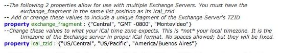

I've updated the [iCal-Invite-Fix script](https://thefragens.com/2008/08/ical-exchange-time-zone-fix-chapter-2/) again. This time to allow for adding multiple Exchange servers to the script so that you should only need a single script. The set-up is slightly more complex.  As the image above shows there are now only 2 properties, both of which are lists. These lists work together as an array; which means the order of the list items is crucial.

- `exchange_fragment` contains unique fragments of the TZID that the Exchange server sends.
- `ical_tzid` contains the tzid info that iCal expects to see.

If you have any problems setting it up let me know. [This post](https://thefragens.com/2008/08/ical-exchange-time-zone-fix-chapter-2/) has all the info for the script. [Download the iCal-Invite-Fix script](http://pub.thefragens.com/iCal-Invite-Fix.scpt).
