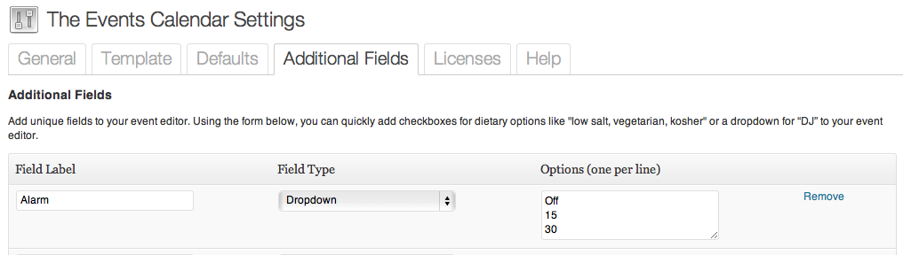

Thanks to Joey Kudish and Jonah at Modern Tribe, Inc., I've converted my original hacked together code to add an alarm to a calendar event created using the [Events Calendar PRO](http://tri.be/wordpress-events-calendar-pro/) WordPress plugin into a plugin of my own. You can see/follow the original discussion on the [Modern Tribe forum](http://tri.be/support/forums/topic/add-alarm-to-event/). 

This plugin **requires** the Events Calendar PRO plugin. You will have to create an _Additional Field_ from _The Events Calendar Settings_ page. 

 

You can then download, install and activate the [The Events Calendar PRO Alarm](http://wordpress.org/extend/plugins/the-events-calendar-pro-alarm/) plugin. If/when this functionality ever becomes part of Events Calendar PRO simply deactivate the plugin.
