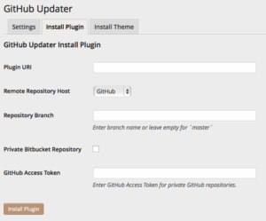

[GitHub Updater v4.1.0](https://github.com/afragen/github-updater/archive/4.1.0.zip) has been pushed and tagged.

## Thanks to My Bug Reporters

First, I need to thank [Jeremy Saxey](https://github.com/jr00ck), [Matt Redford](https://github.com/mattradford), and [w33zy](https://github.com/w33zy) for their bug reports and help in squishing them. Some bugs are difficult to reproduce as everyone's installation is a bit different. What this means is that some bugs when a user first installs the plugin may not show up for me.

## Using Remote Install

Wow, I'm really blown away as to how useful this is. Installing a plugin or theme from either GitHub or Bitbucket involves several steps that are essentially the same.

1. Download the repository (and branch) that you want to install.
2. Unzip the download.
3. Rename the download folder as it will likely have some combination of the `username-repo-hash/branch` as the name.
4. Compress the newly named download.
5. Upload via the WordPress 'Upload Plugin' or 'Upload Theme' interface.

Or you can use the new remote install.  Enter the data and none of the above will be necessary. Sure if you are trying to install from a private Bitbucket repository you will need to add your Bitbucket username and password in the Settings tab. Go and play and be sure to share if you find this helpful. Use hashtag `#GitHubUpdater`.
