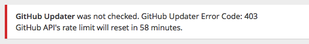

[GitHub Updater](https://github.com/afragen/github-updater) now gives some feedback when the API responds with an error. What I've done is capture the HTTP error code and add that to an `admin_head` hook. I've also included some data if the error is the result of banging against GitHub API's rate limit for unauthenticated accesses.

## Error Codes

As these are HTTP response codes it's pretty simple to figure out. A 401 means that the authorization is incorrect.

- For Bitbucket repos this can mean not having `read` access to the repository or having an incorrect user/pass entered in the Settings.
- For GitHub repos it can mean using an Access Token for a public repository or having the incorrect Access Token for a private repository.

A 403 error usually means that you have surpassed GitHub API's rate limit for unauthenticated access of 60 per hour **or** you have not included an Access Token for a private GitHub repository. If you have knocked up against the rate limit, the error will tell you when your rate limit will be reset. 
