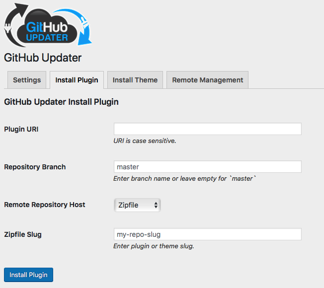

If you maintain your codebase on GitHub, or another git host, the standard download of your repository from within GitHub is an automatically generated zipfile created from your repository. GitHub Updater uses this generated zipfile when it updates or installs a repository from GitHub.

## Build Processes

Sometimes your project may require build tools such as Grunt, Gulp, Webpack, or some other process. The _built_ project is usually added as a _release asset_ to your release. GitHub Updater is capable of updating using this release asset.

## PHP Fatal

Recently a problem and [discussion arose about installing a plugin via either GitHub Updater’s Remote Install function or as a download of a GitHub repository](https://github.com/cedaro/satispress/issues/76). Obviously if the plugin requires a build process to be functional a PHP fatal error is likely to occur as some files will only exist after the completion of the build process.

## Solution

I created a solution where a Zipfile was merely one more type of _git host_ for Remote Installation using GitHub Updater. You may either drop a local file path into the `Plugin URI` field or insert the URI to the remote zipfile.

<figure>

<figcaption>

_Install from a Zipfile or URI of Zipfile_

</figcaption>

</figure>

I was actually pleasantly surprised at how easy it was to add this functionality.
