In the 2018 State of the Word, Matt told us the plan was to move the minimum PHP version for WordPress Core to 5.6 in April 2019 and to PHP 7 in December 2019. I won't discuss the irony of WordPress 5.2 being the update that kills support for PHP 5.2, but the coincidence is remarkable.

Every version of PHP from 7.0 and below has been designated end of life (EOL). Currently, WordPress' minimum PHP requirement is 5.2.7 which was EOL'd over 8 years ago.

In the 2018 State of the Word Matt said we would be moving to PHP 5.6 as a minimum requirement in April, 2019 and increasing the minimum to PHP 7.0 by the end of 2019.

This presentation will attempt to describe the safeguards put in place to avoid breaking the internet. Much of this emanated from a single conceptual [Trac ticket](https://core.trac.wordpress.org/ticket/40934).

### Coding for WP Core is different.

## Overview of Servehappy

It’s no secret that WordPress has stayed on PHP 5.2 long after it’s been cold, dead, and buried. The reasoning was simple. WordPress is used by a third of the internet and even though fewer and fewer sites are using these EOL’d versions of PHP no one wants to break the internet for these people, or anyone else for that matter.

There has been a concerted effort to work with hosting companies to move the needle and it has worked.

Servehappy is the _code name_ for the **Site Health** project. The goal of this project is to put safeguards in place to protect as many users as possible during this transition. Nothing is perfect and the numerical combinations of WordPress versions, PHP versions, plugins, and themes is astronomical.

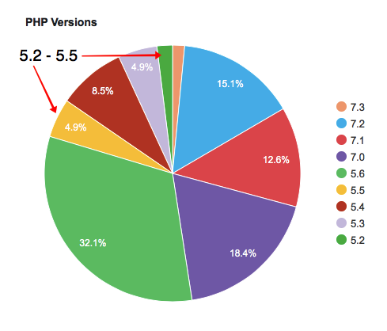

There have been several methods at play.

In WordPress 5.1 the following was added.

- The dashboard call out to update PHP.
- Protection from installing plugins whose requirements are higher than the site can provide.

In WordPress 5.2 the following are scheduled to be added.

- White Screen of Death (WSOD) protection.
- Protection from updating plugins whose requirements are higher than the site can provide.
- Protection from activation of plugins whose requirements are higher than the site can provide.

Many wonderful people have been involved in creating these solutions and they are led by Alain Schlessera and Felix Arntz. I made a conscious decision to participate in this project. Yes, code was involved but like most things in life. You have to show up.

### "Decisions are made by those who show up." - Aaron Sorkin, The West Wing

In this case it meant making time to show up and participate in #core-php and #core Slack meetings.

Sometimes it meant creating solutions/patches in Trac. Sometimes it meant testing other patches. Sometimes it meant reporting issues or problems.

There are many more concerns when coding for WordPress Core than when coding for your own projects. It may be having a higher priority for accessibility or translation readiness, but it shouldn’t.

What I learned was mostly it’s about having to support new functions and filters with an obsession towards backwards compatibility. What this means is that a hard-coded solution is more likely to be acceptable than a more versatile modular solution.

Of course that shouldn’t stop you from creating a solution that utilizes modern techniques but the solution must work within the minimum PHP requirements of Core.

## Update PHP Callout

One of the first things created for the _Servehappy_ project was a dashboard callout to update your site to a current PHP version.

<figure>

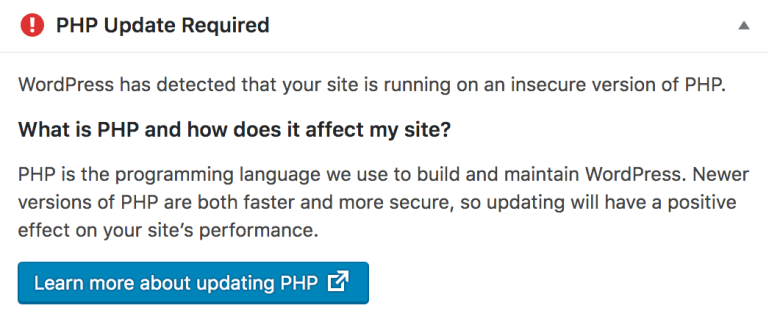

<figcaption>

Dashboard callout

</figcaption>

</figure>

Along with this callout is the [Update PHP](https://wordpress.org/support/update-php) page containing reasons why you should update PHP as well as information on how to get help from your web host on actually updating your PHP version.

In WordPress 5.1 [code](https://core.trac.wordpress.org/ticket/43986) was introduced to provide a check against a Plugin’s [reported compatibility](https://core.trac.wordpress.org/ticket/43650) with either WordPress Core or PHP. The plugin developer would declare these minimum requirements of both WordPress and PHP in the plugin `readme.txt` file.

## Plugin Installation

The code check will disable the **Install** button in the plugin card in the plugin search window and provide information as to why the the plugin cannot be installed.

<figure>

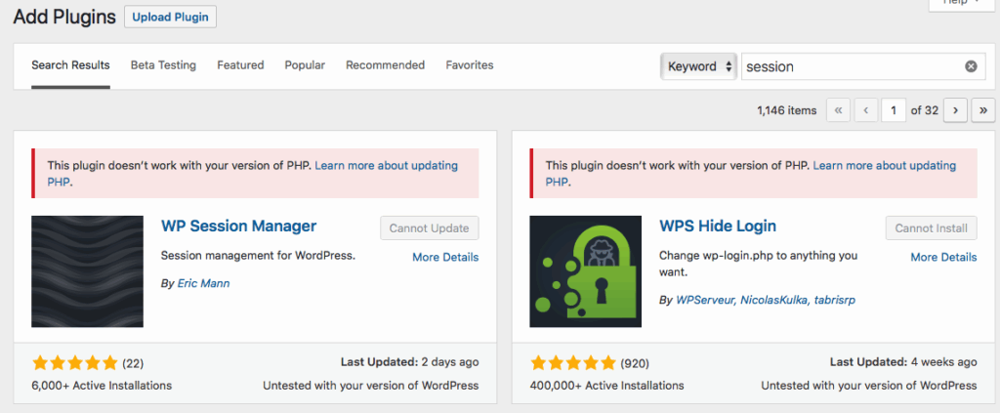

<figcaption>

Plugin Install Screen

</figcaption>

</figure>

<figure>

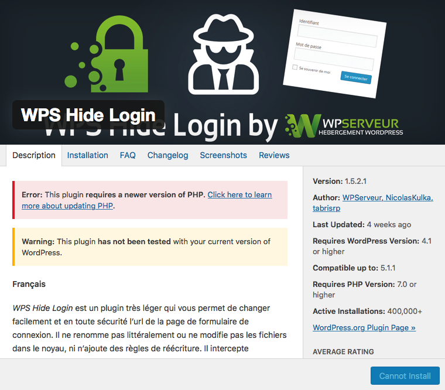

<figcaption>

Plugin Card View Details iFrame

</figcaption>

</figure>

## Plugin Updates

On schedule for inclusion in WordPress 5.2 is the automatic disabling of plugin updates for plugins that don’t meet the WordPress Core or PHP version requirements as listed in the plugin’s `readme.txt` file.

Plugin updates can occur in two locations: the `plugins.php` page and the `update-core.php` page. Disabling updates from both of these locations was introduced in separate Trac tickets, the [plugins screen](https://core.trac.wordpress.org/ticket/43987) and the [updates screen](https://core.trac.wordpress.org/ticket/44350).

<figure>

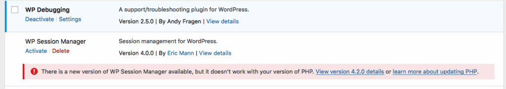

<figcaption>

Plugins Page

</figcaption>

</figure>

<figure>

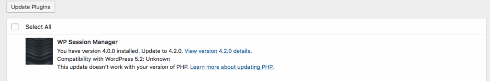

<figcaption>

Updates Page

</figcaption>

</figure>

<figure>

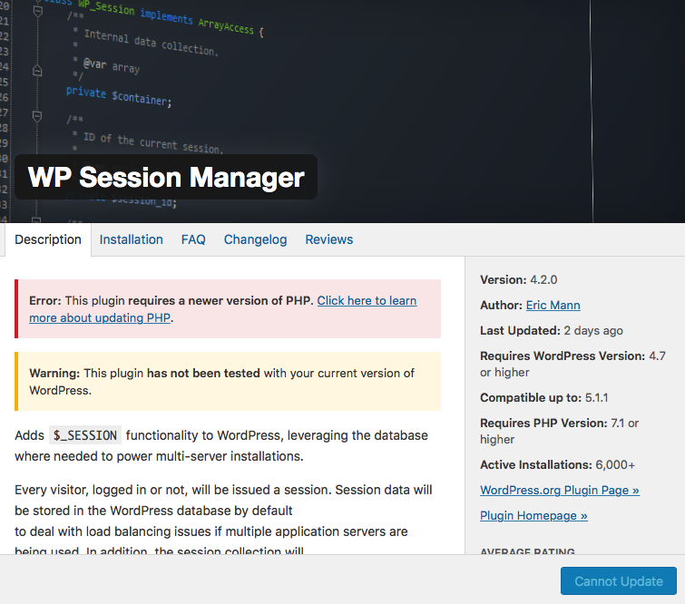

<figcaption>

Plugin Card View Details iFrame

</figcaption>

</figure>

## Plugin Activation

One of the final pieces was to [disable activation](https://core.trac.wordpress.org/ticket/43992) of a plugin if it didn’t meet the WordPress or PHP compatibility requirements. With some help from others I was able to use the `get_file_data()` to parse the plugin’s `readme.txt` file headers.

If a plugin doesn’t meet the minimum compatibility requirements a `WP_Error` is generated, the plugin is not activated, and the user simply needs to use the browser’s back button to return to their site.

Part of the original patch was also adding 2 additional plugin file headers, `Requires WP` and `Requires PHP` so that plugins that exist outside of dot org and don’t have a properly formatted `readme.txt` file could still designate their plugin requirements. This was removed in the commit, opened in a separate [Trac ticket](https://core.trac.wordpress.org/ticket/46938).

<figure>

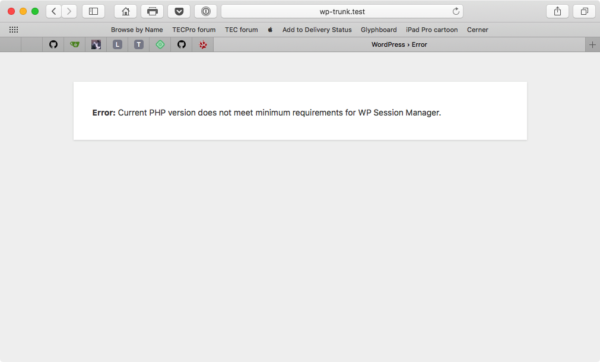

<figcaption>

Activation Error

</figcaption>

</figure>

## WSOD Protection

One of the primary focuses of _Servehappy_ was White Screen of Death (WSOD) protection. It was thought that after an update it would be a huge benefit to be able to create a _sandbox_ for the site so that if a plugin or theme caused a PHP Fatal to occur error it would be a simpler process to access the backend of the site and either effect a change to the plugin or to disable the plugin entirely.

This patch was initially committed for WordPress 5.1 but do to late identification of potential security issues the commit was reverted. A different idea on implementing this is being developed for WordPress 5.2. This new method mitigates the security issues raised in the initial patch. Here is the official post on [WSOD protection](https://make.wordpress.org/core/2019/04/16/fatal-error-recovery-mode-in-5-2/).

<figure>

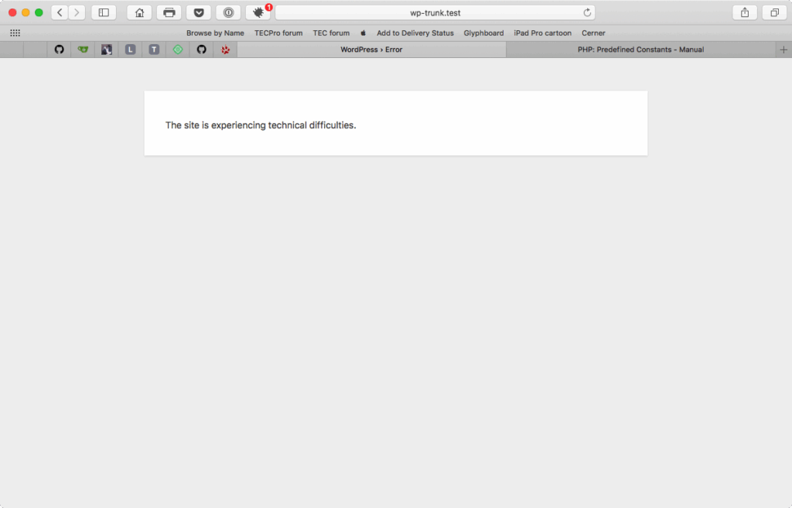

<figcaption>

WSOD Error

</figcaption>

</figure>

<figure>

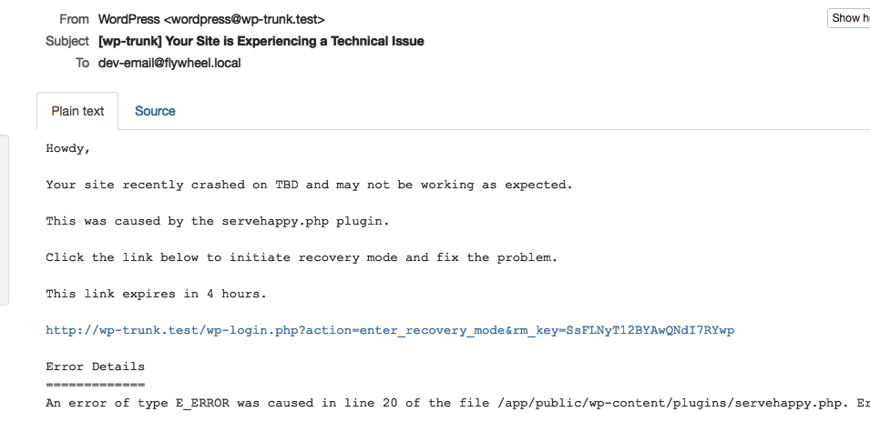

<figcaption>

WSOD email

</figcaption>

</figure>

<figure>

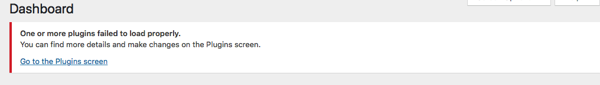

<figcaption>

WSOD dashboard notice

</figcaption>

</figure>

<figure>

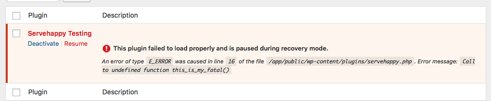

<figcaption>

WSOD disabled plugin

</figcaption>

</figure>

## Perfection??

I don’t really think anything is perfect, but I believe the safeguards created and included in WordPress 5.1 and 5.2 take us most of the way there.

Building a better mousetrap can’t prevent a more determined mouse from success, or in this case failure.
