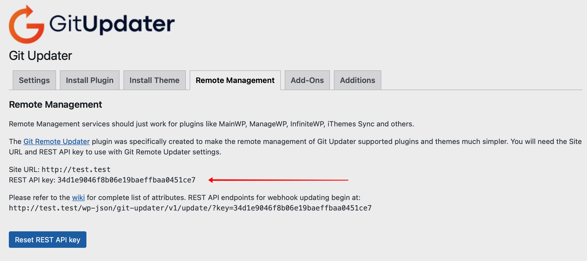
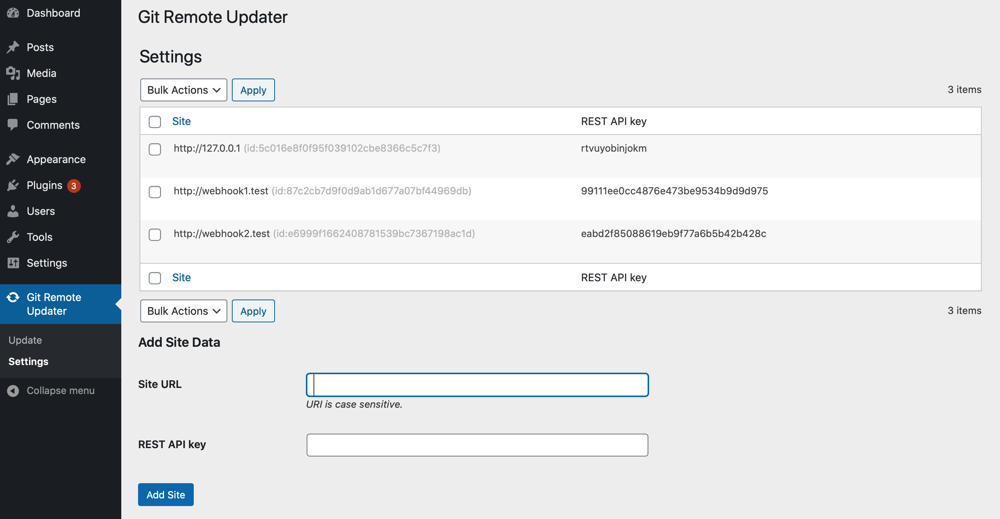
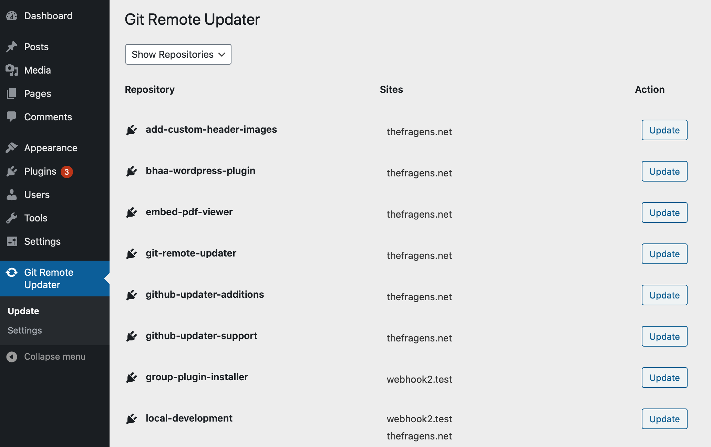
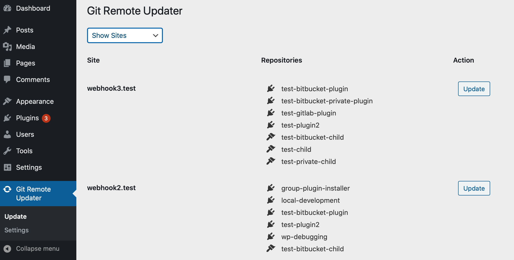
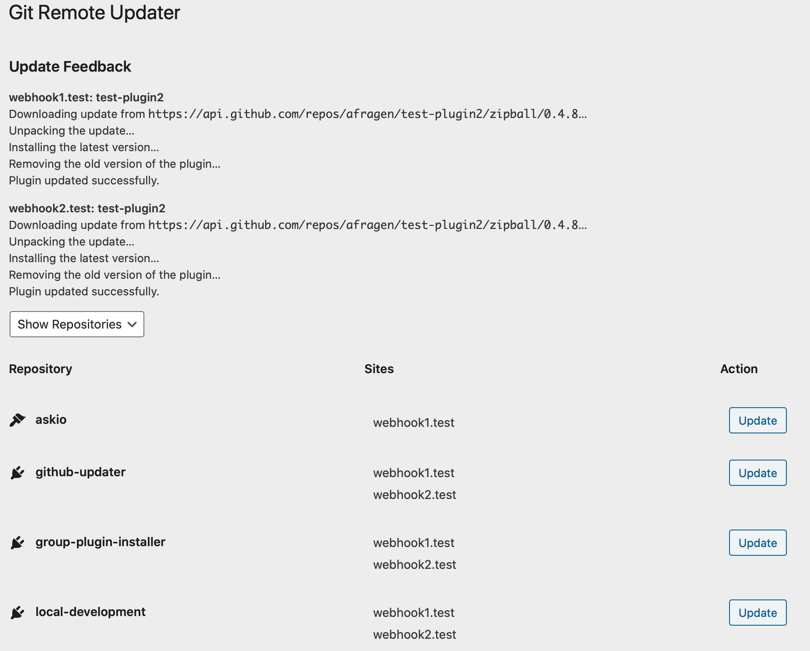

The need or desire to use a personal remote management service makes a few assumptions.

1. It assumes that the developer has personal or client projects that are under version control on a system like GitHub, Bitbucket, GitLab, or some other system.

3. It assumes that these projects are utilized on multiple sites.

5. Lastly, it assumes that the developer would like a simple method of pushing updates to these multiple sites.

Any references to GitHub Updater are now to [Git Updater](https://git-updater.com).

[Git Updater](https://github.com/afragen/git-updater) allows for updating of plugins and themes that are developed outside of the official WordPress repository. Often these projects reside in GitHub, Bitbucket, or GitLab. Updating these repositories to a handful of sites usually involves visiting that site's dashboard and updating the plugin or theme in the usual manner. The difficulty arises when you're managing the same plugin(s) or theme(s) on many, many sites.

## Current State of Updating

You don't want to spend time visiting each site to update these repositories. It takes too long and quickly becomes inconvenient. It's much simpler to use a remote management system and push updates to multiple sites. There are several commercial plugins and services to accomplish this. Among them are iThemes Sync, ManageWP, MainWP, and InfiniteWP.

The problem is that these services were designed only to work with the official WordPress repository and not with GitHub, etc. These plugins all work by showing you that an update is pending and allow you to update all the plugins for a site _en masse_ or all of a particular plugin on multiple sites. Set up of these plugins requires a variable degree of effort and occasional errors can be difficult to troubleshoot.

Git Updater has had the ability to utilize many of these remote management services for a couple of years but it's always been a bit unstable and difficult to test. Recently much of this instability has been removed by allowing for Git Updater's API calls regardless of the web site visitor's privileges. However, it still requires someone visit the site to ensure that WP-Cron runs and Git Updater maintains current update information.

## Webhook Updating

Git Updater has also been able to [utilize a webhook](https://github.com/afragen/github-updater/wiki/Remote-Management---RESTful-Endpoints) to update repositories too. This method doesn't require WP-Cron or anyone to even visit the site. Send the appropriate webhook and the repository will update. Personally, I use a webhook to update Git Updater on the `develop` branch on my test site every time a GitHub `push` is identified. This way I can ensure I'm always testing with the most recent commits.

Updating via a webhook is a more of a push than a pull. For reference, my idea of a pull would be the site shows that an update is pending and pulls the update from the remote source. A push would be similar to a re-installation of the plugin from the current source. In Git Updater's parlance, it's exactly like branch switching. If you switch to the same branch it's simply re-installing with the latest code. There is no version checking in this process.

## REST API Endpoint Updating

Git Updater previously used a `admin-ajax.php` request to provide for webhook updating. I have finally re-written this to an actual REST API endpoint and it has made the Git Remote Updater possible.

Currently there are 3 endpoints.

1. `repos` - returns a listing of the sites Git Updater enabled plugins and themes along with their current branch.

3. `update` - processes the actual webhook request.

5. `[test](https://thefragens.net/wp-json/github-updater/v1/test)` - Yeah, I just left it in. 🙃

## Git Remote Updater

Recently I've written a plugin to facilitate your own personal remote management system, [Git Remote Updater](https://github.com/afragen/git-remote-updater). Git Remote Updater will allow you to update individual repositories on multiple sites or all the repositories in a single site with a single button click.

### How It Works

Functionally, the Git Remote Updater Plugin simply sends a webhook as an HTTP GET request to the site. This allows Git Updater to update the repository. The best part is that Git Remote Updater is able to send multiple webhook requests with a single click.

Git Remote Updater only needs the site’s URL and API key from Git Updater to enter into the Git Remote Updater Settings tab.

<figure>

<figcaption>

Git Updater Site Data

</figcaption>

</figure>

<figure>

<figcaption>

Git Remote Updater Settings

</figcaption>

</figure>

This site specific data is all that is necessary to validate with the site and update the repositories. This data only needs to be updated if the site's Remote Management API key changes.

The API key is easily reset and only functions on the `update` endpoint to authorize an update on the site and one the `repos` endpoint to collect repository data.

There is a [REST API endpoint](https://thefragens.net/wp-json/github-updater/v1/repos) that returns the site's Git Updater enabled plugins and themes along with data regarding the installed branch. The second [REST API endpoint is for updating](https://thefragens.net/wp-json/github-updater/v1/update). It utilizes data from the JSON file to form a correct webhook for updating. Both of these endpoints require an API key for authentication.

In order to ensure that this remote updating works, updating must work on the site's dashboard too. This means that any access tokens or username/password data must be correctly saved on the remote site. I have found that utilizing the Git Remote Updater works best on a local development environment.

### Update by Repository or by Site

There are 2 ways to update in Git Remote Updater. You may update individual repositories on multiple sites or you may update multiple repositories on an individual site. A dropdown menu conveniently switches between the two options.

<figure>

<figcaption>

Git Remote Updater by Repository

</figcaption>

</figure>

<figure>

<figcaption>

Git Remote Updater by Site

</figcaption>

</figure>

### Feedback

An example of the type of feedback supplied is below.

<figure>

<figcaption>

Git Remote Updater Feedback

</figcaption>

</figure>

## Functional Differences

Git Remote Updater doesn't seek to provide feedback about the update status of a particular plugin or theme. It simply forces an update based on the installed branch of the remote repository. This is functionally equivalent to a reinstallation or branch switch to the same installed branch of the repository.
