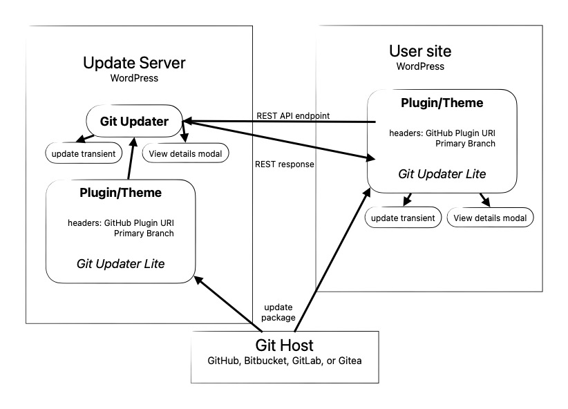

Given the recent concerns regarding publishing plugins or themes on wordpress.org, there has been much interest in other methods of distribution and updating within the ecosystem. [Git Updater](https://git-updater.com) is a method of providing this type of service but it does have a drawback. The user must create an Updates API Server by installing and activating the Git Updater plugin and integrating any plugins/themes via the Additions tab.

Many developers would like a solution that can be directly incorporated into their projects. There are solutions out there to provide this functionality, but I feel they have a much higher overhead and are quite weighty. I have created a two part solution based upon Git Updater running on the developer's site as an update server and a small composer library integrated with the plugin or theme. Consider the site hosting Git Updater as the [Update API Server](https://thefragens.com/update-api-server/). The actual updates come directly from the git host, ie GitHub.

Currently, an embedded updater must contain a fair amount of code to gather and create the necessary data to integrate with WordPress' update transient. Git Updater performs all these functions with a series of API calls to the git host to gather data and then parses that data to a format that is tightly integrated into WP Core's updating system. The integration with Git Updater is via the Additions tab. Any embedded updater must accomplish something similar but for each individual plugin or theme. Consequently all the code to gather data from API calls to the git host must reside in the plugin or theme to be updated.

Since Git Updater already gathers and parses this data, Git Updater Lite only needs to query an update server run by the developer. Since the update server, and Git Updater, does all the heavy lifting the user has much less overhead and is able to gather the data in the proper format from the update server via a single REST API endpoint for each plugin or theme.

<figure>



<figcaption>

Git Updater/Git Updater Lite workflow

</figcaption>

</figure>

The primary advantage is that the most complicated code lies outside of the actual embedded updater library. It also means less overhead for the user's site when that data needs to be refreshed.

## Composer library

I have written a small composer library, [afragen/git-updater-lite](https://github.com/afragen/git-updater-lite). Currently it is a single class file around 400 lines and less than 12 Kb in size. This is significantly lighter weight than the current most popular embedded updater. The integration is only two lines of code. The reason that Git Updater Lite can be so lightweight is its tight integration with Git Updater on the update server.

## REST API Endpoint

Git Updater has a REST API endpoint capable of providing a JSON response compatible with the `plugins_api()` or `themes_api()`. This REST endpoint requires that the plugin or theme is fully integrated with Git Updater. This integration is only a few additional headers in the main plugin file or the theme's style.css file for Git Updater and only a small composer library and 2 lines of code to integrate `git-updater-lite`.

Examples of the endpoints are as follows:

- `https://my-site.com/wp-json/git-updater/v1/update-api/?slug=my-plugin`

- `https://my-site.com/wp-json/git-updater/v1/update-api/?slug=my-theme`

Obviously each individual distributed plugin or theme with `git-updater-lite` must be active to receive updates.

Git Updater Lite is capable of serving updates from any of the following git hosts: GitHub, Bitbucket, GitLab, or Gitea; as long as the appropriate Add-On is installed. Currently Git Updater Lite supports public and private repositories. This support depends upon the developer having a complete integration of their own plugins and themes with a Git Updater based Update API Server. These plugins and themes do not need to be installed on their site to maintain the current versions, but they must be integrated via the Additions tab.

The REST API endpoint returns a JSON response that provides all the information necessary to provide complete integration with the dashboard update system. The API data is lightly cached via a transient.

## Getting Started - For Developers

**Step 1:** _Integrate your plugin or theme with Git Updater Lite_

- Run `composer require afragen/git-updater-lite:^2`

- Add the `Update URI: <update server URI>` header to your plugin or theme headers. Where `<update server URI>` is the domain to the update server, eg `https://git-updater.com`.

- Add the following lines to your main plugin file or theme's functions.php

```php
require_once __DIR__ . '/vendor/afragen/git-updater-lite/Lite.php';
( new Fragen\Git_Updater\Lite( __FILE__ ) )->run();
```

- Update your plugin or theme on the on the git host to this fully integrated version.

**Step 2:** _Set up the Update API Server._

- Have a publicly accessible WordPress installation, such as the plugin's website.

- Install and activate Git Updater 12.9.0 or later.

- Install your plugin or theme via the Git Updater Additions tab.

- Ensure that Git Updater sees your repository as fully integrated via the appropriate tab, ie GitHub, in Git Updater Settings. You can also check the response from the REST endpoint above.

## Access tokens

Any private repositories, or repositories on GitLab or Gitea, require an authentication token. If the tokens are set on the update server, they will be used via the API response for the Authentication header to download the update from the appropriate git host.

## General Comments

This system puts slightly more work on the developer to have their plugins and themes integrated with both Git Updater and Git Updater Lite on their update server. After that, all they really need to do is set those plugins and themes to auto-update. This will help the update server continue to distribute up-to-date plugins and themes. Please refer to [Git Updater's Knowledge Base regarding versioning](https://git-updater.com/knowledge-base/versions-branches/).

I believe this to be the simplest method of integrating an updater into your plugin or theme and update outside of the wp.org repositories.

There is more information at [https://github.com/afragen/git-updater-lite](https://github.com/afragen/git-updater-lite). Please let me know if you have any issues integrating your projects with either Git Updater or Git Updater Lite. There is an example plugin at [https://github.com/afragen/test-plugin-gu-lite](https://github.com/afragen/test-plugin-gu-lite). To test, I usually decrease the local version number.
